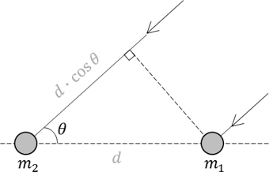

# Acoustic Localization with 2 Microphones
The purpose of this hobby project is to create a GUI in Laptop, which can perform an acoustic localisation (i.e. detection of a noise source) with 2 microphones connected to TI Launchpad microcontroller (MCU). The animated gif below shows what this program can do.

## Data acquisition in TI [TM4C123GXL](https://www.ti.com/tool/EK-TM4C123GXL)
- High Performance TM4C123GH6PM MCU
- Communication with Laptop using UART Serial
- Two 12-bit ADCs with 2 microphones [KY-037](http://sensorkit.en.joy-it.net/index.php?title=KY-037_Microphone_sensor_module_(high_sensitivity)) are used

- MCU with 2 microphones and Webcam (connected to laptop) is shown below

- One can improve the performance of system by using a [low pass filter](https://github.com/Hoi-Jeon/Live-FFT/blob/master/Analog%20Low%20Pass%20Filter/LPF_Circuit.png)

## Theory

## Graphical User Interface in C#
GUI is written in C# and its main function is to get the phase between two microphones from TI Launchpad, and to dispaly it together with an webcam image in real time.
- The version of Visual studio is Community 2019
  - NET Framework 4.7.2
  - WinForms (Not WPF)
- Frequency domain data: Phase information
  - Number of FFT line: 128
  - Highest frequency: up to 2048 Hz, but surely, the data between 1700 Hz and 2048 Hz would be contaminated with an aliasing
  - The cross-spectrum of two inputs are done with [CMSIS DSP library](https://www.ti.com/lit/an/spma041g/spma041g.pdf?ts=1591993440214&ref_url=https%253A%252F%252Fwww.google.de%252F)
- Webcam image
  - AForge / AForge.Video / AForge.Video.DirectShow
  - Those packages are available in [NuGet Packages](https://www.nuget.org/packages/AForge/)

## Open points
- Show FFT spectrum from two microhpones
- Use a contour plot instead of a single red line, in order to show the location of noise source

## Remarks
Some parts of C# codes are got from internet search and I always tried to copy the codes **with reference** and **without violating any copyright**. Nevertheless, please let me know if there is any possible copyright infringement issue in the codes. Then, I will remove it from the repository immediately.
